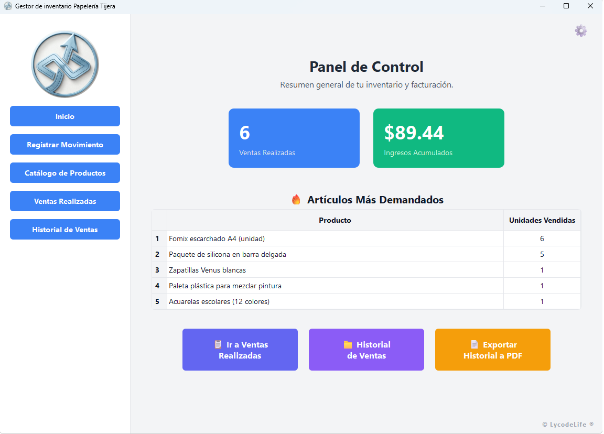
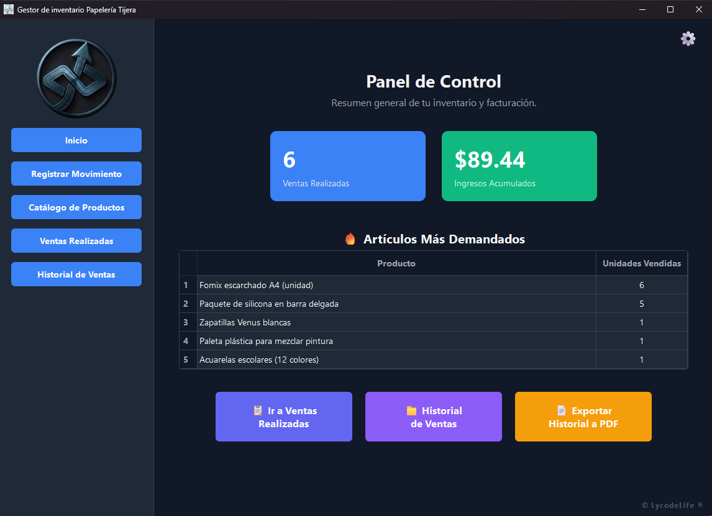
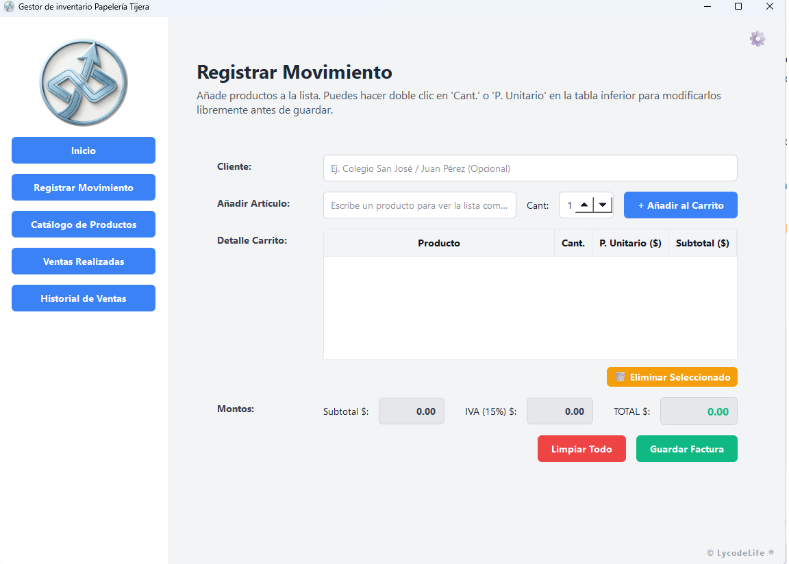
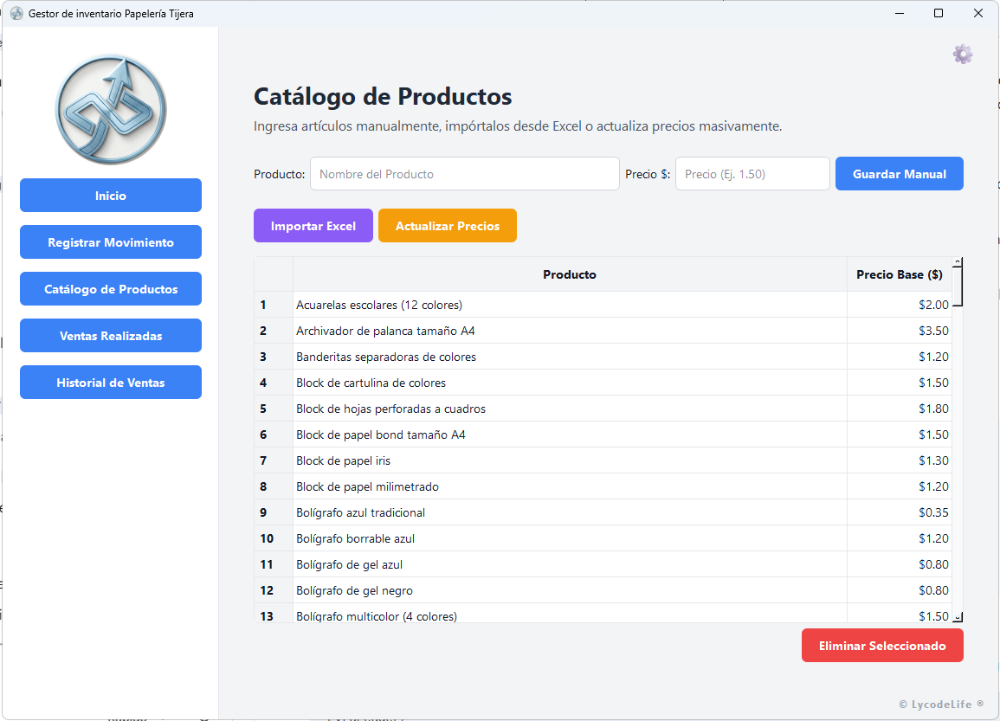

# **Lyra Ledger 💠**

**Gestión de Artículos y Control de Ventas por LycodeLife**

Lyra Ledger es una solución de ingeniería robusta diseñada para la gestión integral de inventarios y procesos de facturación de manera **100% local**. Este software prioriza la privacidad absoluta y el rendimiento de bajo nivel, operando sin dependencias de red o servicios en la nube.

## **🚀 Estado de la Versión: Standalone Binary**

Este software se distribuye como un **binario ejecutable (.exe)** optimizado para entornos Windows, garantizando una implementación de "cero configuración".

* **Privacidad por Diseño:** Los datos se procesan y almacenan en un motor SQLite local. Tu información nunca sale de tu estación de trabajo.  
* **Versión de Evaluación:** Esta entrega permite un flujo de trabajo sin restricciones hasta alcanzar el umbral de **25 registros de facturación**.  
* **Zero-Install:** Portabilidad completa; el sistema está listo para operar desde cualquier directorio local.

## **📸 Preview del Sistema**

## **Vista Principal (Tema Claro)**
  
## **Panel de Control (Tema Oscuro)**
  

## **Registro de Movimientos**

## **Catálogo e Inventario**

## **Instalar Firmas digitales**

Basta simplemente con hacer doble click al archivo .bat llamado Instalar_Licencia.bat como administrador para que no desactives tu antivirus ni expongas tu equipo a malware
## **📁 Arquitectura de Archivos**

Para garantizar la estabilidad del sistema y el renderizado de la interfaz, el ejecutable requiere mantener la siguiente estructura de directorios:

LyraLedger/    
├── LyraLedger.exe          \# Binario principal del sistema    
├── screenshots/            \# Capturas de pantalla para documentación    
└── lycodeLife/             \# Núcleo de recursos del software    
    └── resources/          \# Activos gráficos críticos    
        ├── logoclaro.png   \# Logo corporativo (Light Mode)    
        └── logooscuro.png  \# Logo corporativo (Dark Mode)

**Aviso Técnico:** No modifiques ni elimines la carpeta lycodeLife, ya que contiene los recursos necesarios para el motor gráfico de la aplicación.

## **🏗️ Ingeniería Detrás del Software**

* **Motor de Búsqueda:** Procesamiento mediante QSortFilterProxyModel para filtrado instantáneo en bases de datos extensas.  
* **Gestión de Errores:** Sistema de monitoreo pasivo que genera reportes técnicos en LycodeLife\_Log.txt ante cualquier anomalía.  
* **Normalización:** Algoritmos de búsqueda con normalización Unicode para ignorar caracteres especiales y tildes.

## **💎 Adquiere tu Licencia Full**

Si deseas eliminar el límite de transacciones, desbloquear funciones multiusuario o solicitar una personalización exclusiva de la interfaz para tu empresa, contáctanos:

👉 [**Sitio Oficial de LycodeLife**](https://www.lycodelife.com)

*"Recupera tu tiempo con programas adaptados a tu ritmo"*
